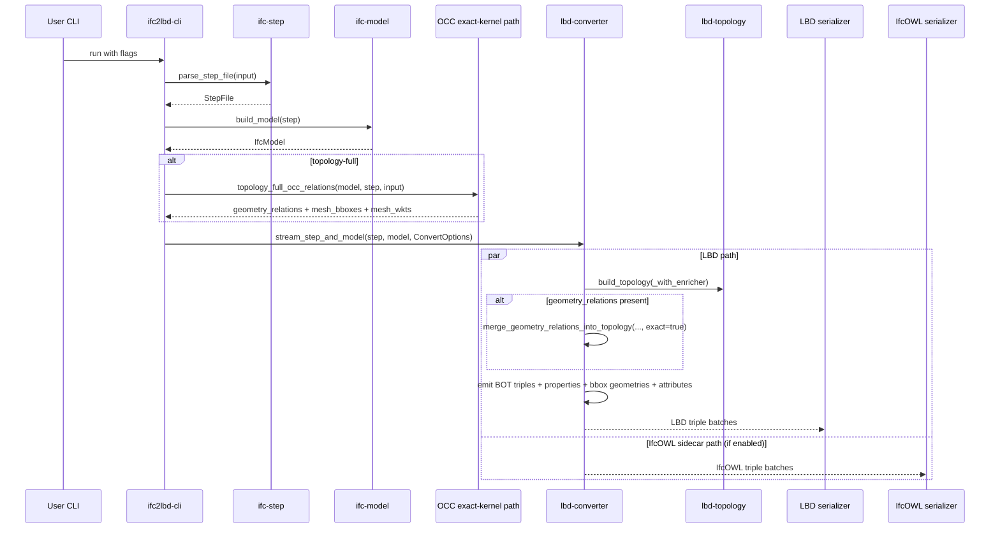

# Full Topology Workflow (Current)

This document describes what happens today when running the CLI with topology-related flags.

Relevant flags:

- `--topology`
- `--topology-full`
- `--bbox`

## Behavior Matrix

- no topology flag:
  - no topology graph build
  - fallback containment logic only
- `--topology` enabled:
  - build topology graph
  - no geometry adjacency derivation
  - no geometry-derived bounding boxes
- `--topology-full` enabled:
  - build topology graph
  - derive geometry relations with the OCC exact-kernel subprocess workflow in CLI
  - pass `geometry_relations` to converter
- `--bbox` enabled:
  - emit bbox geometry resources in LBD:
    - element `lbd:hasBoundingBox` geometry-node
    - element `geo:hasGeometry` geometry-node
    - geometry-node `a geo:Geometry`
    - geometry-node `geo:asWKT "POLYHEDRALSURFACE Z (...)"^^geo:wktLiteral`
  - bbox generation uses hybrid fallback:
    - fast: transformed local AABB
    - fallback (inflation > threshold): rotated XY OBB WKT + Z extent
  - hidden dev threshold: `--bbox-inflation-threshold` (default `1.5`)

## Sequence Diagram

## Current Internal Steps (Full Topology)

1. CLI parses IFC STEP and builds typed IFC model.
2. CLI optionally computes OCC exact-kernel geometry relations for `--topology-full`.
3. CLI builds `ConvertOptions` and streams to converter.
4. Converter emits core entities.
5. Converter builds topology graph from IFC relations:
   - `IfcRelAggregates` -> `ContainsZone`
   - `IfcRelContainedInSpatialStructure` -> `ContainsElement`
   - `IfcRelSpaceBoundary` -> `AdjacentElement` and `AdjacentZone`
   - `IfcRelVoidsElement` + `IfcRelFillsElement` -> `HasSubElement`
6. Converter optionally merges geometry-derived relations.
7. Converter emits BOT topology triples into LBD output.
8. Converter streams IfcOWL sidecar in parallel if `--ifcowl` is enabled.

## Important Current Nuance

`--topology-full` currently uses the OCC exact-kernel subprocess path and merges those relations as core topology evidence in converter. The voxel helper code still exists in the CLI as legacy/exploratory implementation material, but it is not the active main path for `--topology-full`.
